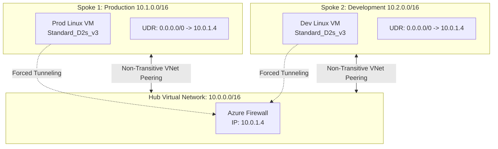

# Enterprise Hub-and-Spoke Network Architecture in Azure

## Overview

This project demonstrates the deployment of a highly secure, enterprise-grade Hub-and-Spoke network topology in Microsoft Azure, fully codified and provisioned using **Terraform**.

The architecture enforces strict **Zero-Trust network principles**. Two isolated environments (Production and Development) are peered to a central Hub Virtual Network. User-Defined Routes (UDRs) are implemented to hijack all East-West and North-South traffic, forcing it through a central **Azure Firewall** for inspection and filtering.

## Architecture Diagram

_(Rendered natively via Mermaid.js)_

## Technology Stack

Cloud Provider: Microsoft Azure

Infrastructure as Code (IaC): Terraform (HCL)

Networking: Azure Virtual Networks (VNet), VNet Peering, Subnetting (CIDR Math)

Security & Routing: Azure Firewall (Basic SKU), User-Defined Routes (UDR), Custom Route Tables

Compute: Azure Linux Virtual Machines (Ubuntu 22.04 LTS)

## Key Features & Technical Implementations

Centralized Security: Deployed an Azure Firewall in a dedicated subnet to act as the single point of entry and exit for the entire cloud footprint.

Network Isolation: Provisioned completely isolated Production and Development Virtual Networks to prevent unauthorized lateral movement.

Custom Routing (UDR): Overwrote Azure's default system routes. Implemented custom Route Tables attached to the Spoke subnets to force all traffic (0.0.0.0/0) to the Firewall's private IP (10.0.1.4).

Non-Transitive Peering: Configured VNet peering connections between the Spokes and the Hub with allow_forwarded_traffic enabled, strictly prohibiting direct Spoke-to-Spoke communication.

Cost-Optimized IaC: Engineered the deployment to be fully declarative, allowing the entire enterprise network to be provisioned via terraform apply and torn down via terraform destroy in minutes to eliminate idle cloud costs.

## Validation & Testing

To prove the Zero-Trust routing architecture is functioning correctly, a ping test was executed from the Production VM to the Development VM via the Azure Portal's "Run Command" feature (bypassing the need for SSH/Bastion).

Because the UDRs successfully forced the ping into the Azure Firewall, and the Firewall operates on a "Deny All" default stance, the ping resulted in 100% packet loss. This confirms the virtual machines are completely segmented and lateral movement is blocked unless explicitly permitted by firewall rules.

## Deployment Instructions

Clone this repository to your local machine.

Authenticate to Azure via the Azure CLI:

Bash
az login
Initialize the Terraform working directory:

Bash
terraform init
Review the execution plan:

Bash
terraform plan
Provision the infrastructure:

Bash
terraform apply
(Note: The Azure Firewall provisioning process takes approximately 5-10 minutes).

Teardown: To avoid unnecessary Azure billing, destroy the environment when testing is complete:

Bash
terraform destroy
